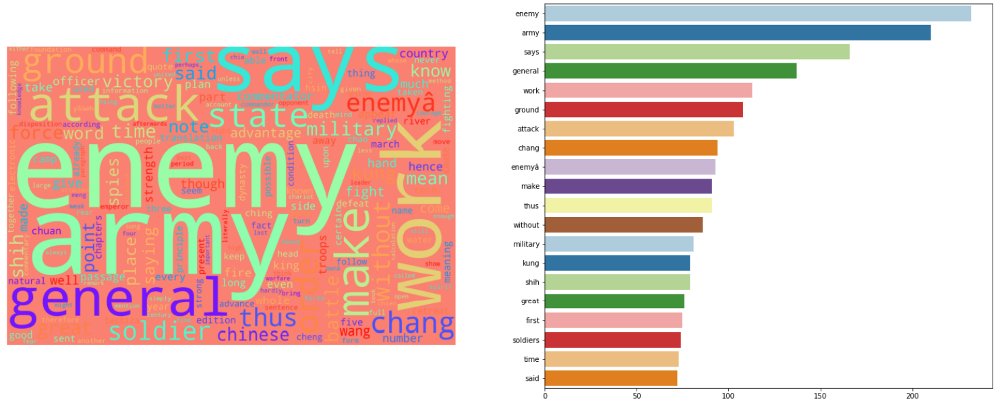
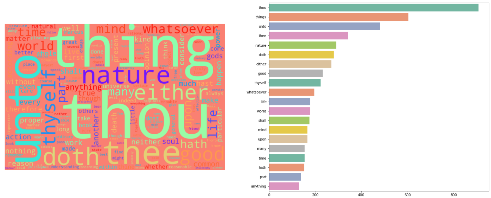

# Gutenberg Book Classification

# Table of Contents

[Objective](#1)

[Team Members](#2)

[Overview](#3)

[Project Methodology](#4)

[Dataset](#5)

- [Data Exploration](#6)

- [Data Preprocessing](#7)

- [Dataset Building](#8)

- [Word Cloud Visualizations](#9)

[Word Embedding](#10)

- [BOW](#11)

- [N-Gram](#12)

- [TF-IDF](#13)

[Models](#14)

- [SVM](#15)

- [K-Nearest Neighbors](#16)

- [Decision Tree](#17)

[Cross Validation](#18)

[Results](#19)

[Error Analysis](#20)

- [Plot Wrong Predictions](#21)

- [Play with Features](#22)

[Augmentation by Reinforcement Learning](#23)

- [TextRL](#24)

- [Example](#25)

- [Prepare for Training](#26)

- [Prediction](#27)

[Conclusion](#28)

# <a name ="1">Objective</a>

The project was part of our AI & Data Science Master's degree at the University of Ottawa. 

Kaggle link: [Link](https://www.kaggle.com/code/mostafanofal/gutenberg-book-classification)

Check all the projects here: [Link](https://github.com/Mostafanofal453)

# <a name = "2">Team Members </a>

[Gehad Hisham](https://www.linkedin.com/in/gehad-hisham/)

[Kareem Bakli](https://www.linkedin.com/in/kareem-bakli-b48228138/)

[Kareem Khaled](https://www.linkedin.com/in/kareemwaly/)

[Mostafa Nofal](https://www.linkedin.com/in/mostafa-nofal-772625194/)

# <a name = "3">Overview</a>

**Project Gutenberg is a library of over 60,000 free eBooks**


[ // ]: # "![image]&#40;https://drive.google.com/uc?export=view&id=1ejaH42xuYMN7ZBdYm5_-3cLCVaziO2rH;"

In this project, we selected scrapped books from the Gutenberg library from different categories using BeautifulSoup and then select random paragraphs from them and labeled these paragraphs by the book name for ground truth. After creating the dataset we used many transformation algorithms to embed the text to numbers for the modeling processes like TF-IDF, BOW, and N-gram
<br>
After this, we tried the classification algorithms like SVM, KNN, and Decision Tree to choose the champion one which achieved the highest accuracy. Finally we tried some error analysis techniques.

# <a name = "4">Project Methodology</a>


[ // ]: # "![image]&#40;https://drive.google.com/uc?export=view&id=1akpmZttK1SGFR5cTG4vdm0wkeM5bAGqg;"

# <a name = "5">Dataset</a>

We scrapped 5 books with different authors and with the same genre (Philosophy genre):

- The Art of War
- Beyond Good and Evil
- The Psychology and Pedagogy of Anger 
- The Republic 
- Meditations

## <a name="6">Data Exploration</a>

By discovering the books’ content as shown below, many problems have been found in books' content, so we should deal with them.

> \n\n\n\n\nThe Project Gutenberg eBook of The Art of War, by Sun Tzu  body { margin-left: 20%;       margin-right: 20%;       text-align: justify;} h1, h2, h3, h4, h5 {text-align: center; font-style: normal; font-weight: normal; line-height: 1.5; margin-top: .5em; margin-bottom: .5em;} h1 {font-size: 300%;    margin-top: 0.6em;    margin-bottom: 0.6em;    letter-spacing: 0.12em;    word-spacing: 0.2em;    text-indent: 0em;} h2 {font-size: 175%; margin-top: 2em; margin-bottom: 2em;} h3 {font-size: 150%; margin-top: 2em;} h4 {font-size: 120%;} h5 {font-size: 110%;} hr {width: 80%; margin-top: 2em; margin-bottom: 2em;} div.chapter {page-break-before: always; margin-top: 4em;} p {text-indent: 1em;   margin-top: 0.25em;   margin-bottom: 0.25em; } .p1 {margin-top: 1em;     margin-bottom: 1em;     font-size: 90%;} .p2 {margin-top: 0em;     margin-bottom: 0em;     font-size: 90%;} .p3 {margin-top: 2em;} p.poem {text-indent: 0%;        margin-left: 10%;        font-size: 90%;        margin-top: 1em;        margin-bottom: 1em; } p.noindent {text-indent: 0% } p.center  {text-align: center;           text-indent: 0em;           margin-top: 1em;           margin-bottom: 1em; } a:link {color:blue; text-decoration:none} a:visited {color:blue; text-decoration:none} a:hover {color:red}			The Project Gutenberg eBook of The Art of War, by Sun TzÅ­ This eBook is for the use of anyone anywhere in the United States and most other parts of the world at no cost and with almost no restrictions whatsoever. You may copy it, give it away or re-use it under the terms of the Project Gutenberg License included with this eBook or online at [www.gutenberg.org](http://www.gutenberg.org/). If you are not located in the United States, you will have to check the laws of the country where you are located before using this eBook.

## <a name="7">Data Preprocessing</a>

**Clean the content of the books by:**

- Converted the text to lower case
- Removed any special characters
- Used RegexpTokenizer to tokenize the text. 
- Created our stop words list and removed from our text
- Remove single char, and chars with size 2

## <a name = "8">Dataset Building</a>

We created 200 partitions of each book text, each partition contains 100 words

We come out with a DataFrame contains: 

- Partitions columns
- The title of the book column, 
- Author column. 

**Note:** Before starting to transform words. We split the data into training and testing, to prevent data leakage.


[ // ]: # "![image]&#40;https://drive.google.com/uc?export=view&id=1qomCIEv4ZpQxra1g0of3I9a3YQ4DG-6t;"

## <a name = "9">Word Cloud Visualizations</a>

Data visualizations (like charts, graphs, infographics, and more) give a valuable way to visualize, and statistical important information, but what if your raw data is text-based? Word cloud generators can help simplify this process. 

<br>

A word cloud is a collection, or cluster, of words depicted in different sizes. The bigger and bolder the word appears, the more often it’s mentioned within a given text and the more important it is.

| All Books |  |
| --------- | ------------------------ |
| Book 1    |  |
| Book 2    |  |
| Book 3    |  |
| Book 4    |  |
| Book 5    |  |

[//]: # (| ![image]&#40;https://drive.google.com/uc?export=view&id=1En0jDHSl4HR-oR_LCEVKETZFhDSa_d4X; | ![image]&#40;https://drive.google.com/uc?export=view&id=1Sy0BdvHkW6Apcug4N7DyydoWZtp2eGpH;        | ![image]&#40;https://drive.google.com/uc?export=view&id=1bdLnUy4s7xQ3K846qE5hYodKizTDw7rd;  | ![image]&amp;#40;https://drive.google.com/uc?export=view&id=10LPhXTlolhURCCOK6ljusXOn741syyRJ; | ![image]&amp;#40;https://drive.google.com/uc?export=view&id=1CSUIVHD6GPwklapeCAQa61vW2woXjmGC;        | ![image]&amp;#40;https://drive.google.com/uc?export=view&id=11hfVNJrqaYxpDRpQ4O7rY-QyCbdeCGv0;)

# <a name="10">Word Embedding</a>

It is one of the trivial steps to be followed for a better understanding of the context of what we are dealing with. After the initial text is cleaned and normalized, we need to transform it into features to be used for modeling.

## <a name="11">BOW</a>

A bag of words is a representation of text that describes the occurrence of words within a document, just keeps track of word counts and disregard the grammatical details and the word order. As we said that we split the data. So, we applied BOW to training and testing data. So, it transforms each sentence into an array of occurrences in this sentence.
```Python
from sklearn.feature_extraction.text import CountVectorizer
def bow_emb(data):
    count_vectorizer = CountVectorizer()
    emb = count_vectorizer.fit_transform(data)
    return emb, count_vectorizer

X_train_bow_emb, count_vectorizer = bow_emb(X_train)
X_test_bow_emb = count_vectorizer.transform(X_test)
```
## <a name = "12">N-Gram</a>

By Default ngram equal to 1 but we tried also n = 2

```Python
from sklearn.feature_extraction.text import CountVectorizer
def bow_emb(data):
    count_vectorizer = CountVectorizer(ngram_range=(2, 2))
    emb = count_vectorizer.fit_transform(data)
    return emb, count_vectorizer


X_train_ngram_emb, count_vectorizer = bow_emb(X_train)
X_test_ngram_emb = count_vectorizer.transform(X_test)
```

## <a name="13">TF-IDF</a>

 TF-IDF (term frequency-inverse document frequency) is a statistical measure that evaluates how relevant a word is to a document in a collection of documents. This is done by multiplying two metrics: how many times a word appears in a document, and the inverse document frequency of the word across a set of documents.

```Python
from sklearn.feature_extraction.text import TfidfVectorizer

def tfidf(data):
    tfidf_vectorizer = TfidfVectorizer()
    train = tfidf_vectorizer.fit_transform(data)  
    return train, tfidf_vectorizer

X_train_tfidf_emb, tfidf_vectorizer = tfidf(X_train)
X_test_tfidf_emb = tfidf_vectorizer.transform(X_test)
```

# <a name="14">Models</a>
## <a name = "15">SVM</a>

SVM is a supervised machine learning algorithm that separates classes using hyperplanes.

## <a name = "16">K-Nearest Neighbors</a>

K-Nearest Neighbors is a non-parametric supervised algorithm. Despite its simplicity it can be highly competitive in NLP applications. 

## <a name = "17">Decision Tree</a>

Decision Tree uses a tree-like model in training phase to take a decision and studying its consequences.

# <a name = "18">Cross Validation</a>

So, we have 9 models on all of our transformation methods. We used K-Fold cross validation with 10 folds and compared the accuracy of each model to choose the champion model with the best transformation and classification algorithm. We also put into consideration its Mean, Bias, variance, standard deviation.

Example for TF-IDF with the models:

```python
cross_valadation(XX_tfidf,y,models)

""""" output:
accuracy of each fold of  Support Vector Machine  - [0.96, 0.93, 0.96, 0.93, 0.91, 0.92, 0.95, 0.95, 0.95, 0.9]
Mean : 0.94
Standard devaition : 0.02
Bais : 0.09
Variance: 1.92

accuracy of each fold of  K-NeighborsClassifier  - [0.95, 0.9, 0.93, 0.93, 0.87, 0.93, 0.94, 0.94, 0.93, 0.86]
Mean : 0.92
Standard devaition : 0.03
Bais : 0.07
Variance: 1.95

accuracy of each fold of  Decision Tree Classifier  - [0.87, 0.85, 0.77, 0.87, 0.81, 0.85, 0.81, 0.76, 0.84, 0.81]
Mean : 0.82
Standard devaition : 0.04
Bais : 0.14
Variance: 1.91
""""
```

# <a name = "19">Results</a>

Final Testing Accuracy for all the compinations

|                         | BOW  | 2-Gram | TF-IDF            |
| ----------------------- | ---- | ------ | ----------------- |
| **SVM**                 | 0.94 | 0.58   | <mark>0.95</mark> |
| **K-Nearest Neighbors** | 0.81 | 0.54   | 0.89              |
| **Decision Tree**       | 0.86 | 0.73   | 0.94              |

From the results above, the best accuracy comes from the SVM classifier trained on the TF-IDF embedding vector and the achieving training accuracy is 97.5% and testing accuracy is 95.5%.

# <a name="20">Error Analysis</a>
 ## <a name="21">Plot Wrong Predictions</a>
- We calculated the number of wrong prediction labels by comparing the predicted output with the actual output of each class.

- Then we plotted the number of wrong predictions of each class to see which labels the model struggled to predict right.


[ // ]: # "![image]&#40;https://drive.google.com/uc?export=view&id=1G7pGDUJ0sb63k1qeHbEUc6AnmRIVaDR4;"

 ## <a name="22">Play with Features</a>
we tried to add some books that does not belong to the same category of the original book, without preprocessing its text, and also add some special characters to the original dataset.

<br>

We noticed that the accuracy decreased to 0.57 and this make sense because the model can’t classify which class when we change the features and the shape of the books which the model was trained on. 

# <a name = "23">Augmentation by Reinforcement Learning</a>

## <a name = "24">TextRL</a>

TextRL is Text generation Library with Reinforcement learning using hugging face’s transformer

<br>

We clone to the files in this GitHub link which include library that we used to generate tests

```python
!git clone https://github.com/voidful/TextRL.git

cd '/content/TextRL'

pip install -e .
```

## **<a name = "25">Example</a>**

Controllable generation via RL to let Elon Musk speak ill of DOGE

- before: i think dogecoin is a great idea.
- after: i think dogecoin is a great idea, but I think it is a little overused.

<br>

Setup reward function for environment

- predicted(list[str]): will be the list of predicted token
- finish(bool): it met the end of sentence or not

predicted(list[str]): will be the list of predicted token finish(bool): it met the end of sentence or not

<br>

## **<a name = "26">Prepare for Training</a>**

observaton_list should be a list of all possible input string for model training

```python
observaton_list=["I ate dinner",
"We had a three-course meal",
"Brad came to dinner with us",
"He loves fish tacos",
"In the end, we all felt like we ate too much",
"We all agreed; it was a magnificent evening",
"I hope that, when I’ve built up my savings, I’ll be able to travel to Mexico",
"Did you know that, along with gorgeous architecture, it’s home to the largest tamale?",
"Wouldn’t it be lovely to enjoy a week soaking up the culture?",
"Oh, how I’d love to go!",
"Of all the places to travel, Mexico is at the top of my list.",
"Would you like to travel with me?",
"Isn’t language learning fun?",
"There is so much to understand.",
"I love learning!",
"Sentences come in many shapes and sizes.",
"Nothing beats a complete sentence.",
"Once you know all the elements, it’s not difficult to pull together a sentence."]
```

## <a name = "27">**Prediction**</a>

```python
#agent.load("somewhere/best") # loading the best model
actor.predict("dinner")
```

# <a name="28">Conclusion</a>

To wrap up, we made 9 model on different transformation methods and it was obvious that SVM perform better than other models, this is because the data is slightly few, and SVM performs better when data is small. When comparing transformation methods, it clear that TF-IDF is trained better compared with the other models..
